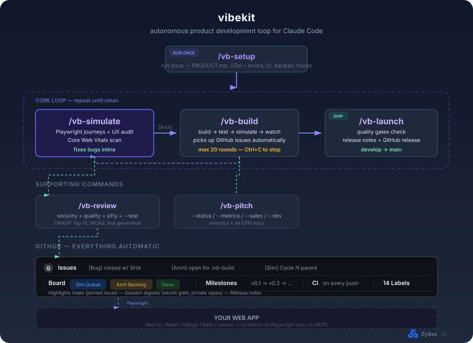

<p align="center">
  
</p>

# vibekit

**Your product gets better while you sleep.**

Simulated customers find bugs. Claude fixes them. Everything ships to GitHub automatically. No tickets. No QA cycle. No coordination.

Built by [ZySec AI](https://zysec.ai).

---

## Install

```bash
curl -fsSL https://raw.githubusercontent.com/ZySec-AI/vibekit/refs/heads/develop/install.sh | bash
```

**Requirements:** [Claude Code](https://claude.ai/code) + [GitHub CLI](https://cli.github.com) (`gh auth login`) + Node.js

---

## 3 commands to ship

```bash
/vb-setup      # one-time: scans your codebase, sets up everything
make dev       # start your app
/vb-simulate   # bugs found, fixed, and tracked — runs until you stop it
```

When you're ready:

```bash
/vb-build      # implements architectural issues (one approval, then autonomous)
/vb-launch     # quality gates → GitHub release → merge to main
```

Or let it do everything: `/vb-build --auto` runs the full loop — build, simulate, build, repeat — until launch gates pass.

---

## How it works

<p align="center">
  
</p>

---

## What it does

**`/vb-simulate`** — the core loop. Runs indefinitely.

- Generates real customer personas from your product spec
- Runs Playwright journeys for each persona
- Fixes every bug inline, commits to `develop`
- Creates GitHub Issues for architectural gaps
- Audits every page on 9 UX dimensions
- Measures Core Web Vitals
- Updates a Kanban board, milestones, and a Highlights Index — automatically

**`/vb-build`** — implements open `[Arch]` issues autonomously.

- Shows a plan, gets one approval, then builds everything
- Reads codebase → implements → verifies via Playwright → commits → closes issue
- `--auto` mode: full autonomous loop — build → simulate → build → repeat until launch-ready
- `--daemon` mode: watches for new issues and builds them continuously

**`/vb-launch`** — ships when quality gates pass.

- Blocks on: open critical/high bugs, failing tests, UX score < 7/10, missing GTM docs
- Auto-increments version, generates release notes, creates GitHub release
- Closes milestone, opens next, merges `develop` → `main`

**`/vb-review`** — deep code review + test generation.

- Security (OWASP Top 10), code quality, accessibility — outputs GitHub Issues
- `--test` generates unit/integration/e2e tests using your existing framework
- `--fix` auto-fixes quality and UI findings
- `--pr N` scopes review to a single PR

**`/vb-pitch`** — analytics and documentation.

- `--status` project health at a glance
- `--metrics` trend analysis across simulation cycles
- `--sales` / `--dev` / `--investor` generates all GTM and technical docs from real data

---

## Everything tracked in GitHub

Every bug, every fix, every cycle — structured GitHub Issues with full traceability.

| What | Where |
|------|-------|
| Bugs found and fixed | `[Bug]` issues — closed with commit SHA |
| Architectural gaps | `[Arch]` issues — on Kanban board |
| Simulation cycles | `[Sim] Cycle N` parent issues with tasklists |
| Release progress | Milestones (`v0.1` → `v0.2` → ...) |
| Board state | GitHub Projects — Sim Queue / Arch Backlog / Done |
| CI | GitHub Actions — runs on every push to `develop` |
| Session logs | Secret gists (private repos only) |
| Highlights | Pinned GitHub Issue — updated every cycle |

---

## Works with any web app

Next.js, React/Vite, Django, Rails, Laravel — anything with a browser UI and a GitHub remote.

---

MIT  [ZySec AI](https://zysec.ai) | [hello@zysec.ai](mailto:hello@zysec.ai) | [Issues](https://github.com/ZySec-AI/vibekit/issues)
